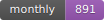
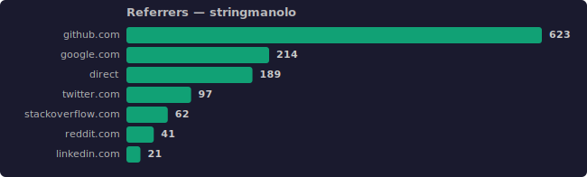
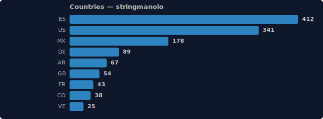
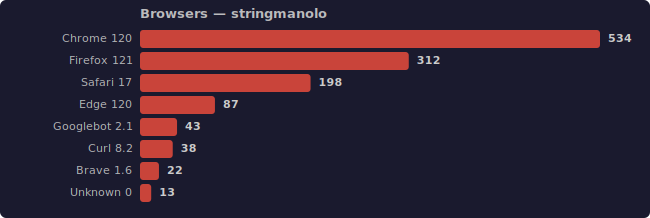
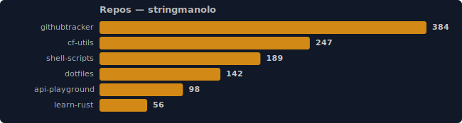
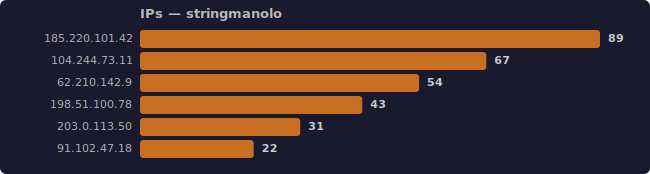
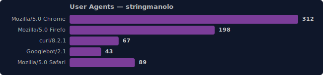

# Github Tracker

A Cloudflare Workers-powered visit tracker for GitHub profiles and repositories. Every visit stores full metadata — IP, referrer, User-Agent, raw headers, country, browser — and exposes a rich set of stats endpoints that return JSON, SVG badges, or bar-chart graphs.

---

## Live badge (put this in your GitHub README)


```markdown

```

Per-repo badge:


```markdown

```

> ☝️ These badges are **live** — the counter increments every time this README is rendered.

---

## What it looks like

### Badges

Default green badge (live — counter increments on every view):


Repo-specific badge (live):


Custom label + blue color (live — `?label=profile+views&color=%233498db`):


Monthly stats badge — uses `/stats/monthly?svg=1` which requires `apikey`, so it can't be a live image in a public README. Sample output:



### Graphs (`?graph=1`)

Referrers breakdown:



Countries (via Cloudflare's `CF-IPCountry`):



Browsers & versions:



All tracked repos:



IPs (sensitive — requires `apikey`):



User-Agents (sensitive — requires `apikey`):



---

## Setup

```bash
# 1. Create KV namespace
npx wrangler kv namespace create VISITS_KV
# → copy the ID into wrangler.toml

# 2. Set your API key (stored as an encrypted secret, never in code)
npx wrangler secret put API_KEY

# 3. Deploy
npx wrangler deploy

# Local dev
npx wrangler dev   # → http://localhost:8787
```

---

## Environment

| Variable | How to set | Purpose |
|---|---|---|
| `VISITS_KV` | `wrangler.toml` binding | KV namespace for all data |
| `API_KEY` | `wrangler secret put API_KEY` | Required on all `/stats/*` endpoints |

---

## Public endpoints (no auth needed)

### `GET /` — Track + Badge

This is the only endpoint that records a visit. It **always** returns an SVG badge. Every image embed in your README hits this, so every page-view is automatically tracked.

| Param | Default | Description |
|---|---|---|
| `user` | `anonymous` | Profile identifier |
| `repo` | — | If set, also increments repo-level counters |
| `label` | `{user} views` | Left side text of the badge |
| `color` | `#4c1` | Right side background color |
| `textcolor` | `#fff` | Text color |
| `labelcolor` | `#555` | Left side background color |

```bash
BASE="https://github-tracker.stringmanolo.workers.dev"

# Basic profile badge
curl "$BASE/?user=stringmanolo"

# Repo badge
curl "$BASE/?user=stringmanolo&repo=visit-tracker"

# Custom label + blue color
curl "$BASE/?user=stringmanolo&label=hello+world&color=%233498db"

# Dark label background
curl "$BASE/?user=stringmanolo&labelcolor=%23222"
```

### `GET /health`

```bash
curl https://github-tracker.stringmanolo.workers.dev/health
# {"status":"ok","timestamp":"2025-01-15T12:00:00.000Z"}
```

### `GET /docs`

Returns the full API documentation as JSON.

```bash
curl https://github-tracker.stringmanolo.workers.dev/docs | jq .
```

---

## Authenticated endpoints (`?apikey=<secret>`)

All `/stats/*` routes require your API key. Use them locally with `curl` — don't embed them in public READMEs.

```bash
BASE="https://github-tracker.stringmanolo.workers.dev"
KEY="your-api-key-here"
```

---

### Profile stats

```bash
# Total visits (all time)
curl "$BASE/stats/total?user=stringmanolo&apikey=$KEY"
# {"user":"stringmanolo","total":1247}

# Today
curl "$BASE/stats/daily?user=stringmanolo&apikey=$KEY"
# {"user":"stringmanolo","date":"2025-01-15","visits":42}

# This week
curl "$BASE/stats/weekly?user=stringmanolo&apikey=$KEY"
# {"user":"stringmanolo","week":"2025-W03","visits":184}

# This month
curl "$BASE/stats/monthly?user=stringmanolo&apikey=$KEY"
# {"user":"stringmanolo","month":"2025-01","visits":891}

# This year
curl "$BASE/stats/yearly?user=stringmanolo&apikey=$KEY"
# {"user":"stringmanolo","year":"2025","visits":1247}
```

As a live badge (no auth needed — this one uses the public `/` endpoint with a custom label):


```bash
# Stats badges that use /stats/*?svg=1 require apikey, so they can't be embedded publicly.
# For public badges, stick to GET / with custom label + color:
curl -o badge.svg "$BASE/?user=stringmanolo&label=my+label&color=%233498db"
```

Sample output of `/stats/monthly?svg=1` (requires auth, can't be live on GitHub):


---

### Repo stats

```bash
# Total for a specific repo
curl "$BASE/stats/repo?user=stringmanolo&repo=visit-tracker&apikey=$KEY"
# {"user":"stringmanolo","repo":"visit-tracker","total":384}

# Today / week / month / year for a repo
curl "$BASE/stats/repo/daily?user=stringmanolo&repo=visit-tracker&apikey=$KEY"
curl "$BASE/stats/repo/weekly?user=stringmanolo&repo=visit-tracker&apikey=$KEY"
curl "$BASE/stats/repo/monthly?user=stringmanolo&repo=visit-tracker&apikey=$KEY"
curl "$BASE/stats/repo/yearly?user=stringmanolo&repo=visit-tracker&apikey=$KEY"

# All repos with totals (JSON)
curl "$BASE/stats/repos?user=stringmanolo&apikey=$KEY"
# {"user":"stringmanolo","repos":[{"repo":"visit-tracker","total":384},{"repo":"cf-utils","total":247},...]}

# All repos as a graph
curl -o repos.svg "$BASE/stats/repos?user=stringmanolo&apikey=$KEY&graph=1"
```


---

### Referrer stats

```bash
# All referrers
curl "$BASE/stats/referrers?user=stringmanolo&apikey=$KEY"
# {"user":"stringmanolo","referrers":[{"referrer":"github.com","visits":623},{"referrer":"google.com","visits":214},...]}

# Single referrer
curl "$BASE/stats/referrer?user=stringmanolo&apikey=$KEY&ref=github.com"
# {"user":"stringmanolo","referrer":"github.com","visits":623}

# Referrers graph
curl -o referrers.svg "$BASE/stats/referrers?user=stringmanolo&apikey=$KEY&graph=1"
```


---

### Country breakdown

Country is resolved instantly via Cloudflare's `CF-IPCountry` header — no external API or IP database needed.

```bash
# JSON
curl "$BASE/stats/country?user=stringmanolo&apikey=$KEY"
# {"user":"stringmanolo","countries":[{"country":"ES","visits":412},{"country":"US","visits":341},...]}

# Graph with custom colors
curl -o countries.svg "$BASE/stats/country?user=stringmanolo&apikey=$KEY&graph=1&bgcolor=%230f172a&color=%233498db"
```


---

### Browser breakdown

Browser name and version are parsed from the User-Agent string. Supports Chrome, Firefox, Safari, Edge, Opera, Brave, Vivaldi, Samsung Browser, bots (Googlebot, Bingbot), CLI tools (curl, wget), and more.

```bash
# JSON
curl "$BASE/stats/browser?user=stringmanolo&apikey=$KEY"
# {"user":"stringmanolo","browsers":[{"browser":"Chrome","version":"120.0","visits":534},...]}

# Graph
curl -o browsers.svg "$BASE/stats/browser?user=stringmanolo&apikey=$KEY&graph=1&color=%23e74c3c"
```


---

### Sensitive endpoints

> ⚠️ These expose raw IPs and full User-Agent strings. Use only locally with `curl`. Do not embed in public pages.

#### IPs

```bash
curl "$BASE/stats/ip?user=stringmanolo&apikey=$KEY"
# {"user":"stringmanolo","ips":[{"ip":"185.220.101.42","visits":89},{"ip":"104.244.73.11","visits":67},...]}

curl -o ips.svg "$BASE/stats/ip?user=stringmanolo&apikey=$KEY&graph=1&color=%23e67e22"
```


#### User-Agents

```bash
curl "$BASE/stats/useragent?user=stringmanolo&apikey=$KEY"
# {"user":"stringmanolo","userAgents":[{"userAgent":"Mozilla/5.0 (X11; Linux x86_64) ...","visits":312},...]}

curl -o uas.svg "$BASE/stats/useragent?user=stringmanolo&apikey=$KEY&graph=1&color=%238e44ad&bgcolor=%230f172a"
```


#### Recent visits (full metadata)

Returns the last N visits with every piece of stored data: referer, IP, date, User-Agent, raw headers, country, browser.

```bash
curl "$BASE/stats/recent?user=stringmanolo&apikey=$KEY&limit=3" | jq .
```

```json
{
  "user": "stringmanolo",
  "visits": [
    {
      "timestamp": 1736944320000,
      "referer": "https://github.com/stringmanolo",
      "ip": "185.220.101.42",
      "date": "2025-01-15T14:32:00.000Z",
      "userAgent": "Mozilla/5.0 (X11; Linux x86_64) AppleWebKit/537.36 (KHTML, like Gecko) Chrome/120.0.0.0 Safari/537.36",
      "headers": {
        "user-agent": "Mozilla/5.0 (X11; Linux x86_64) AppleWebKit/537.36 ...",
        "referer": "https://github.com/stringmanolo",
        "accept": "text/html,application/xhtml+xml",
        "accept-language": "en-US,en;q=0.9",
        "cf-ipcountry": "ES",
        "cf-connecting-ip": "185.220.101.42",
        "sec-ch-ua": "\"Chromium\";v=\"120\", \"Google Chrome\";v=\"120\"",
        "sec-ch-ua-platform": "\"Linux\"",
        "sec-ch-ua-mobile": "?0"
      },
      "country": "ES",
      "browser": "Chrome",
      "browserVersion": "120.0.0.0",
      "repo": "visit-tracker"
    }
  ]
}
```

---

## Graph & badge rendering params

Append any of these to **any** `/stats/*` endpoint:

| Param | Effect | Example |
|---|---|---|
| `&svg=1` | Returns a badge SVG instead of JSON | `&svg=1&label=monthly` |
| `&graph=1` | Returns a horizontal bar-chart SVG | `&graph=1` |
| `&label=text` | Custom badge label (svg mode) | `&label=this+week` |
| `&color=#hex` | Badge right-side / bar color | `&color=%233498db` |
| `&textcolor=#hex` | Text color | `&textcolor=%23fff` |
| `&labelcolor=#hex` | Badge left-side background | `&labelcolor=%23222` |
| `&bgcolor=#hex` | Graph background | `&bgcolor=%230f172a` |
| `&barcolor=#hex` | Graph bar color (overrides `color`) | `&barcolor=%2310b981` |

---

## What gets tracked per visit

Every single hit to `GET /` stores this payload (90-day TTL):

```json
{
  "referer": "https://github.com/stringmanolo",
  "ip": "185.220.101.42",
  "date": "2025-01-15T14:32:00.000Z",
  "userAgent": "Mozilla/5.0 (X11; Linux x86_64) ...",
  "headers": {
    "user-agent": "...",
    "referer": "...",
    "accept": "...",
    "accept-language": "en-US,en;q=0.9",
    "cf-ipcountry": "ES",
    "cf-connecting-ip": "185.220.101.42",
    "sec-ch-ua": "\"Chromium\";v=\"120\"",
    "sec-ch-ua-platform": "\"Linux\"",
    "sec-ch-ua-mobile": "?0"
  },
  "country": "ES",
  "browser": "Chrome",
  "browserVersion": "120.0.0.0",
  "repo": "visit-tracker"
}
```

---

## Implementation notes

- **Country detection** uses Cloudflare's built-in `CF-IPCountry` header. Zero external dependencies, zero latency overhead.
- **Browser detection** parses the User-Agent with regex. Covers all major browsers, bots (Googlebot, Bingbot, DuckDuckBot), and CLI tools (curl, wget, lynx, w3m).
- **Individual visit metadata** has a 90-day TTL to keep KV storage manageable. Aggregated counters (daily, monthly, etc.) do not expire.
- **The `meta:index` array** caps at 5,000 entries (most recent). Increase the cap in `kvPushCapped` if needed.
- **Security**: all `/stats/*` endpoints require `apikey`. The key is stored as a Cloudflare secret — it never appears in your code or repo.
